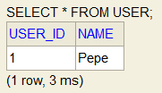
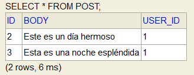

# OneToManyRelation
Example of One To Many relation in spring boot

In this example two entities are created, User and Post, a user can create many posts so a OneToMany relationship is established

To achieve this, the posts attribute is defined in the user entity as follows

	@OneToMany(cascade = CascadeType.ALL)
	@JoinColumn(name="user_id", referencedColumnName="user_id")
	private List<Post> posts;

And in the Post entity, the attribute by which the two entities will be linked is defined

	@Column(name="user_id")
	private Integer userId;

This allows us to automatically create new posts from the user entity administration

		
			User user1 = new User();
			Post post1 = new Post();
			post1.setBody("Este es un día hermoso");
			
			Post post2 = new Post();
			post2.setBody("Esta es una noche espléndida");
			
			user1.setName("Pepe");
			user1.setPosts(Arrays.asList(post1,post2));
			
	    userRepository.save(user1);
      
      

Executing the previous code the user Pepe is created and simultaneously two posts are created

      

